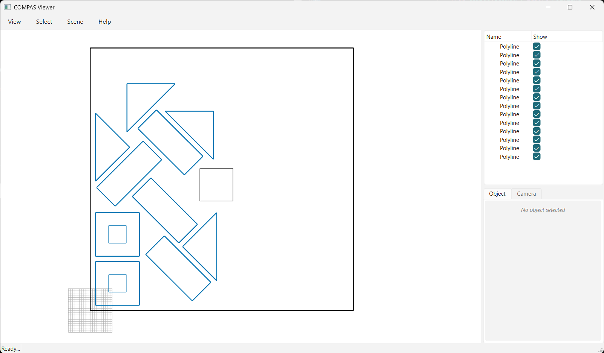

# Examples

Each example builds the input, runs an engine, shows the result in compas_viewer, and writes the
placed polylines + transformations to `data/output/`.

=== "01 · Collision"

    Nest parts (one with a hole) into a sheet (with a hole) using `opennest_collision`, shown with
    the default compas_viewer (sheets black, elements blue).

    <!-- TODO: image -->
    

    ```python
    --8<-- "examples/01_collision_viewer.py"
    ```

=== "02 · NFP + GA"

    Same idea with the NFP + genetic-algorithm engine `opennest` (handles the triangles + holes).

    <!-- TODO: image -->
    

    ```python
    --8<-- "examples/02_nfp_viewer.py"
    ```

=== "03 · NFP on the dataset"

    The NFP + genetic-algorithm engine on the 48-element dataset with many generations, so the best
    layout visibly evolves generation-to-generation. `opennest.start()` runs on a background thread;
    `compas_nest.viewer.animate` polls the layout each frame.

    

    ```python
    --8<-- "examples/03_nfp_animated.py"
    ```

=== "04 · Clearance offset"

    The 48-element dataset nested into two 510×635 sheets with a clearance offset (`offset_geo` /
    `offset_sheets`): the solve runs on offset geometry, and the *original* parts are drawn at the
    solved poses so the real clearance gaps are visible.

    

    ```python
    --8<-- "examples/04_collision_dataset.py"
    ```

=== "05 · Attributes"

    Each part carries an attribute (a point at its centroid) that is transformed along with the part,
    so it ends up at the placed centroid. Any `compas` geometry can be carried this way.

    

    ```python
    --8<-- "examples/05_attributes.py"
    ```

## Without a viewer

`nest_result.placed_polylines()` returns the world-placed geometry grouped per sheet, and
`nest_result.to_json()` serializes it (with transformations) to COMPAS JSON:

```python
result = opennest_collision(iterations=2000).solve(geo, sheets)
for group in result.placed_polylines():
    for part in group["parts"]:
        outline = part["outline"]   # compas Polyline, already transformed into place
        holes = part["holes"]

result.to_json("data/output/result.json")
```
