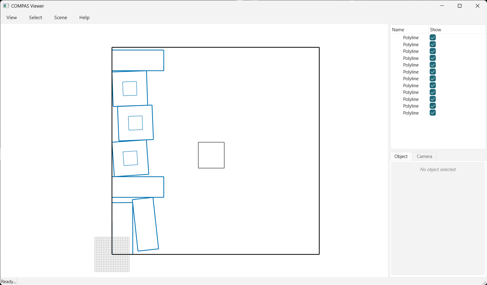

# Collision

Nest parts (one with a hole) into a sheet (with a hole) using `opennest_collision`, shown with the
default compas_viewer (sheets black, elements blue).



```python
--8<-- "examples/01_collision_viewer.py"
```
