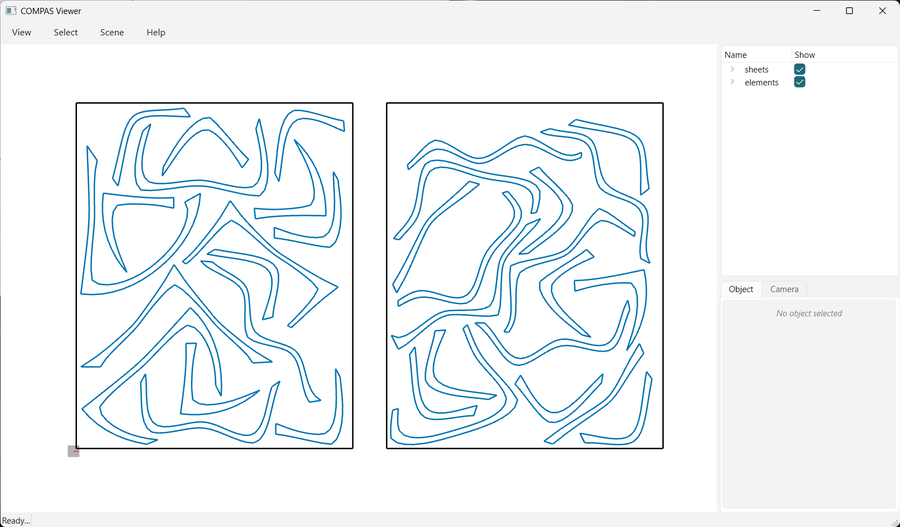

# Live animation (NFP)

The NFP engine on the 48-element dataset with many generations, so the best layout visibly evolves.
`opennest.start()` runs on a background thread; `compas_nest.viewer.animate` polls it each frame.



```python
--8<-- "examples/03_nfp_animated.py"
```
