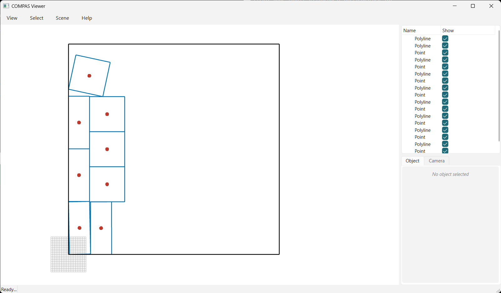

# 05 · Attributes

Each part carries an attribute (a point at its centroid) that is transformed along with the part, so
it ends up at the placed centroid. Any `compas` geometry can be carried this way.



```python
--8<-- "examples/05_attributes.py"
```
