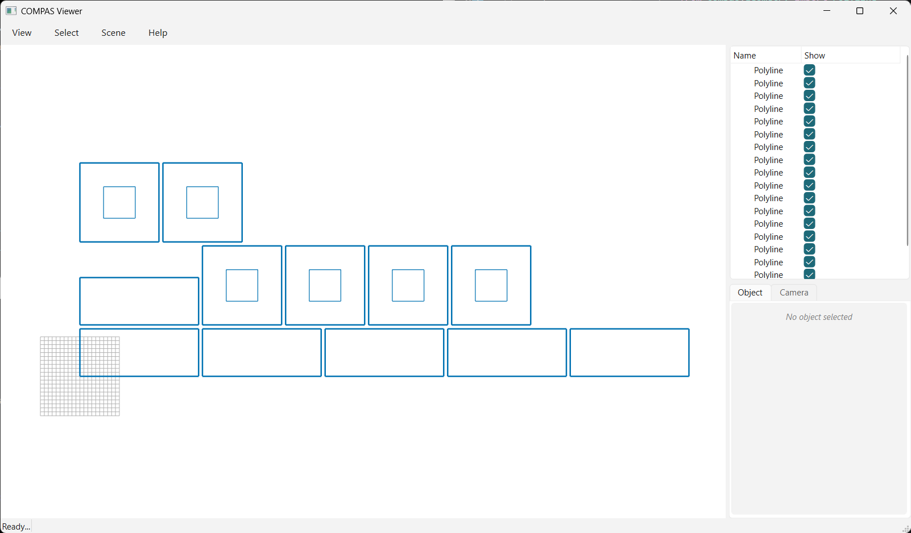

# 06 · Pack (array)

Lay parts out in a simple **array** with `pack` — a fixed number of elements per row, wrapping to the
next row. Deterministic, no nesting; returns a `nest_result`, so `placed_polylines` / `to_json` /
`to_obj` apply.

<!-- TODO: image -->


```python
--8<-- "examples/06_pack_array.py"
```
