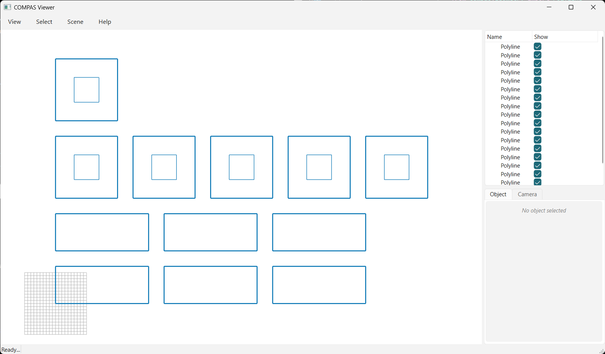

# 07 · Pack (distance)

Pack parts by **row width** with `pack(..., max_width=...)`: a row fills up to the given distance,
then the next element wraps to a new row.

<!-- TODO: image -->


```python
--8<-- "examples/07_pack_distance.py"
```
