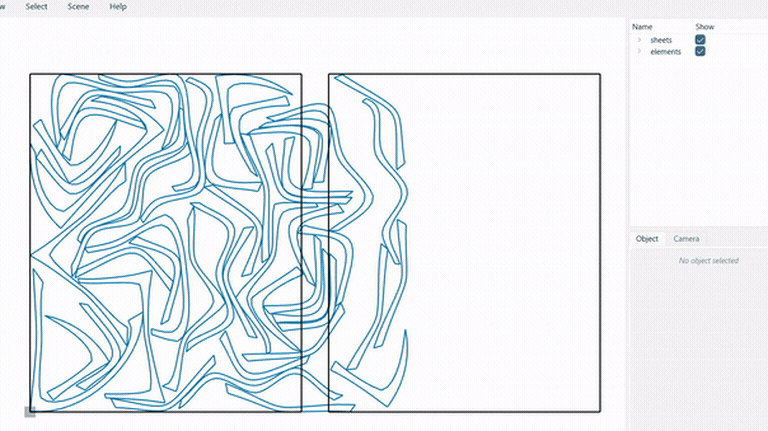

# compas_nest

**2D irregular nesting for the [COMPAS](https://compas.dev) framework.**



`compas_nest` packs irregular parts onto sheets with minimal waste — **parts and sheets may have
holes**, parts can nest **inside** holes, and sheets can be **non-rectangular**. It exposes the C++
nesting engines of [OpenNest](https://github.com/petrasvestartas/OpenNest) to Python through
[nanobind](https://github.com/wjakob/nanobind) (same toolchain as
[compas_cgal](https://github.com/compas-dev/compas_cgal)), with live
[compas_viewer](https://github.com/compas-dev/compas_viewer) visualization and JSON / OBJ output.

## Two engines

| Class | Engine | Notes |
|---|---|---|
| [`opennest_collision`](reference.md#compas_nest.opennest_collision) | physics / overlap-relaxation (`np_nest`) | dependency-free; iteration-budget driven; nests parts into holes |
| [`opennest`](reference.md#compas_nest.opennest) | NFP + genetic algorithm (`nfp_nest`) | bundled Clipper2; generation/fitness driven; carries part *attributes* through placement |

Both nest polylines **with holes** into sheets **with holes**, report live progress, support
cancellation, and add clearance via Clipper2 offsetting (`offset_geo` / `offset_sheets`).

## Quick start

```python
from compas.geometry import Polyline
from compas_nest import nest_geo, nest_sheets, opennest_collision

def rect(x0, y0, w, h):
    return Polyline([[x0, y0, 0], [x0 + w, y0, 0], [x0 + w, y0 + h, 0], [x0, y0 + h, 0], [x0, y0, 0]])

geo = nest_geo()
geo.add_part(rect(0, 0, 20, 10), copies=3)
geo.add_part(rect(0, 0, 15, 15), holes=[rect(5, 5, 5, 5)], copies=2)

sheets = nest_sheets()
sheets.add_sheet(rect(0, 0, 100, 100), holes=[rect(40, 40, 10, 10)])

result = opennest_collision().solve(geo, sheets)
result.to_json("out.json")   # placed polylines + transformations
result.to_obj("out.obj")     # placed outlines + holes
```

Install with `pip install compas_nest` — see [Installation](installation.md) for all options, the
[Examples](examples.md) for the viewer workflows, and [Credits](credits.md) for the underlying work.
